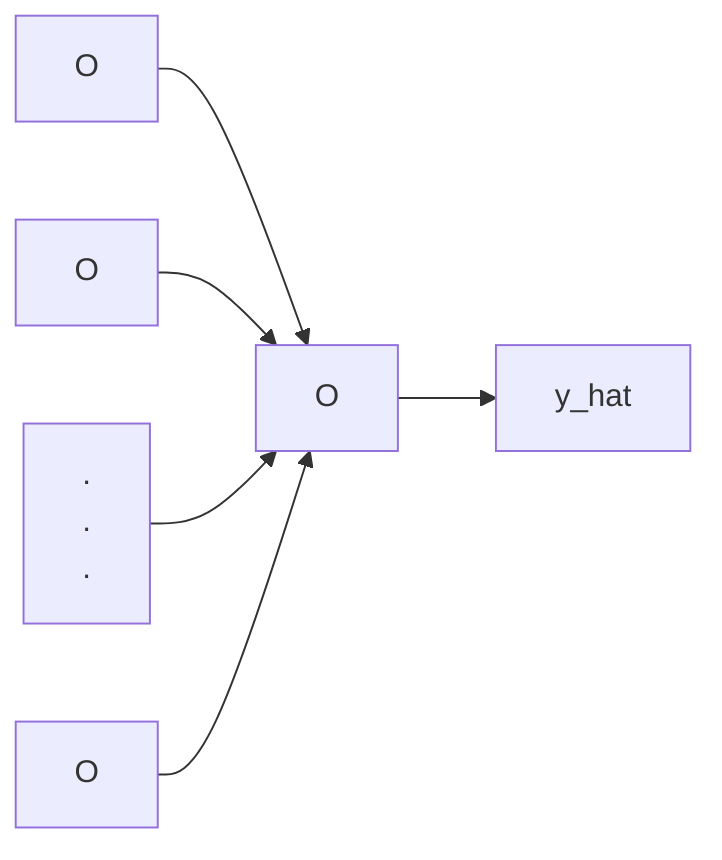

## Artificial Neural Networks

$X = \begin{bmatrix}
x_1\\x_2\\.\\.\\.\\x_n
\end{bmatrix}$

$z^{(i)} = w^Tx^{(i)} + b$

$\hat{y}^{(i)} = a^{(i)} = sigmoid(z^{(i)}) = \frac{1}{1+e^{-z^{(i)}}} $

$L(\hat{y}^{(i)}, y^{(i)}) = -y^{(i)}log(\hat{y}^{(i)}) - (1-y^{(i)})log(1-\hat{y}^{(i)}) $

$J = \frac{1}{m} \sum_{i=1}^{m} L(\hat{y}^{(i)}, y^{(i)}) $

---

$\frac{\partial{J}}{\partial{w}} =  \frac{\partial{J}}{\partial{L}} \times \frac{\partial{L}}{\partial{\hat{y}}} \times \frac{\partial{\hat{y}}}{\partial{z}} \times \frac{\partial{z}}{\partial{w}} = \frac{1}{m} x (\hat{y} - y)$

> - $\frac{\partial{J}}{\partial{L}} = 1 $
> - $\frac{\partial{L}}{\partial{\hat{y}}} = -\frac{y}{\hat{y}} + \frac{1-y}{1-\hat{y}} = \frac{\hat{y}-y}{y\times(1-\hat{y})} $
> - $\frac{\partial{\hat{y}}}{\partial{z}} = \sigma(z) \times \sigma(1-z) = \hat{y} \times {(1-\hat{y})} $
> - $\frac{\partial{z}}{\partial{w}} = x $

$\frac{\partial{J}}{\partial{b}} =  \frac{\partial{J}}{\partial{L}} \times \frac{\partial{L}}{\partial{\hat{y}}} \times \frac{\partial{\hat{y}}}{\partial{z}} \times \frac{\partial{z}}{\partial{b}} = \frac{1}{m} \sum_{i=1}^{m} (\hat{y} - y)$
