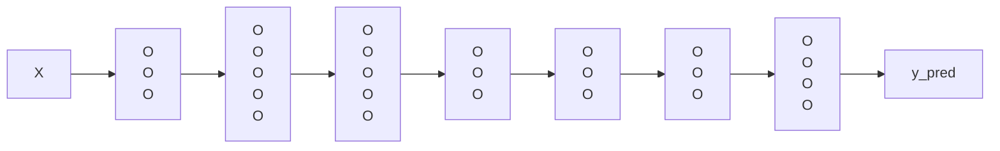

## Hyperparameter Tuning

## Batch Normalization

- **Mean :**
$\mu = \frac{1}{m} \sum_{i=1}^m x^{(i)}$
> Where: 
> - $m$ is the number of samples of batch
> - $x^{(i)} is the $i^{th}$ input of batch

- **Variance :** 
$\sigma^2 = \frac{1}{m} \sum_{i=1}^m (x^{(i)} - \mu)^2 $

- **Batch normalization :**
$\hat{x}^{(i)} = \frac{x^{(i)} - \mu}{\sqrt{\sigma^2} + \epsilon} $
> Where:
> - $\epsilon$ is the small number (used for the case divide by 0 if $\sigma^2$ is very small)
> - $\hat{x}^{(i)} $ is the normalized of $x^{(i)} $

- **Scale & Shift :**
BatchNorm use $\gamma$ and $\beta$ to scale and shift the normalized data:
$y^{(i)} = \gamma \hat{x}^{(i)} + \beta $
> Where:
> - $y^{(i)}$ is the output of layer after BatchNorm
> - $\gamma$ is the **scale parameter**, is learned from the training process
> - $\beta$ is the **shift parameter**, is learned from the training process

## Multi-Class Classification

**Softmax**:

$softmax(z)_i = \frac{e^{z_i}}{\sum_{j=1}^{K} e^{z_j}} $, for $i=1,2...K$
> Where:
> - $K$ is the number of classes
> - $z_i$ is the $i^{th}$ input value
> - $softmax(z)_i$ is the probability that the sample belong to class $i$

**Softmax layer**

> 4 neuron in the final layer is calculated:
> - $P(c_1 | X) \to$
> - $P(c_2 | X) \to$
> - $P(c_3 | X) \to$
> - $P(c_4 | X) \to$

For example:

$z^{[L]} = \begin{bmatrix} 5\\2\\-1\\3 \end{bmatrix} \to t = \begin{bmatrix} 148.4\\7.4\\0.4\\20.1\end{bmatrix} \to \sum_{j=1}^4 t_j=176.3 $ 

$\to a^{[L]} = \frac{t}{176.3} = \begin{bmatrix} 0.842\\0.042\\0.002\\0.114 \end{bmatrix} $

**Loss function**

$y^{(i)} = \begin{bmatrix} 0\\1\\0\\0\end{bmatrix}, a^{[i]} = \hat{y}^{(i)} = \begin{bmatrix} 0.3\\0.2\\0.1\\0.4\end{bmatrix} $

- $L(\hat{y}, y) = -\sum_{j=1}^4 y_j log \hat{y_j} $

- $J = \frac{1}{m} \sum_{i=1}^m L(\hat{y}^{(i)}, y^{(i)}) $