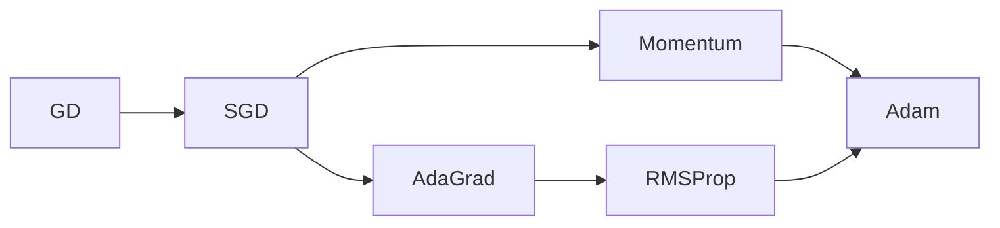
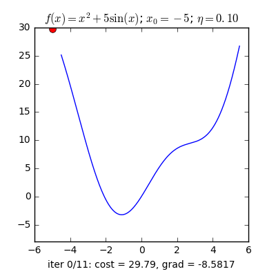
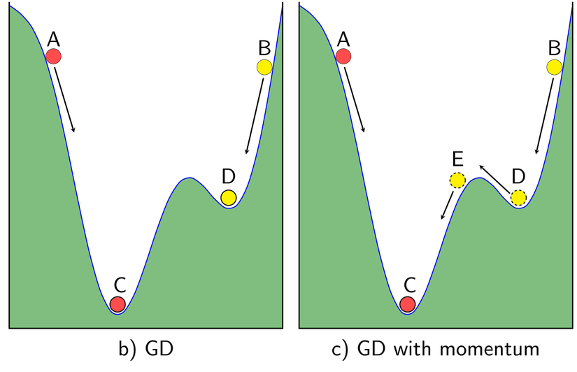
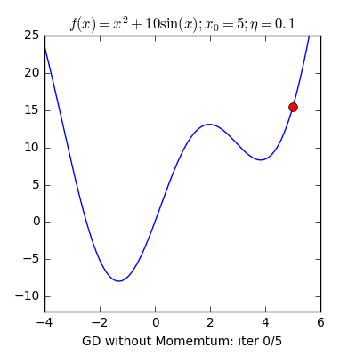
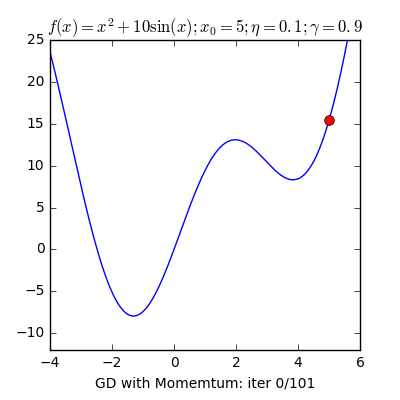
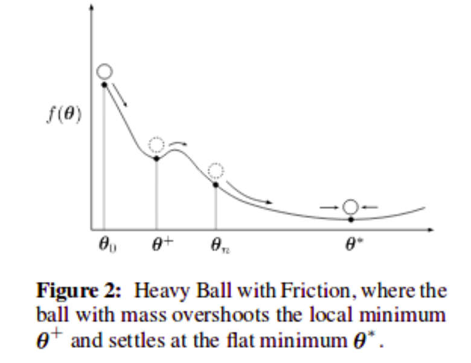

## What is Optimizer

Figure 1: Optimizer Algorithms

### Gradient Descent
- We have the loss function: $L(\theta) $

- $\theta_{t+1} = \theta_{t} - \alpha \times \nabla L(\theta) $
    > - The sign minus "-" indicates that to go **opposite direction of derivative.**
    > - So why is **"opposite direction of derivative"**???
    > - For example: $f(x) = x^2 + 5sin(x)$ with learning rate: 0.10
    

- If we choose different inital x, it will affect the convergence process
- The **learning rate** also has an impact. 
    - If the **learning rate** is too small, the convergence speed is very slow $\to$ affecting the training process
    - If the **learning rate** is too large, it will quickly reach the target. However, the algorithm does not convergent and loops around the destination because the jump is too large

### SGD
> **Stochastic Dradient Descent** is a variantion of **Gradient Descent**. Instead of afger each `epoch` we will update the weight once, in SGD, in each `epoch` with `N` data points we will update the weight `N` times.

> - Looking at the two pictures above, we see that SGD has a pretty zigzag path, not as smooth as GD. It's easy to understand because 1 data point cannot represent the whole data. 
> - Question why should use SGD instead of GD even though its path is quite zigzag? Here, GD has a limitation for large databases (several million data), it becomes cumbersome to calculate the derivative over the entire data through each loop. 
> - Besides, GD is not suitable for online learning. Online learning is when data is continuously updated (for example, adding registered users), then each time we add data we have to recalculate the derivative on the entire data.

- The SGD formula is similar to GD but is performed on each data point.

- Advantage: The algorithm can handle large database that **Gradient Descent** cannot. This optimization algorithm is still commonly used today
- Disadvantage: This algorithm has not yet solved 2 major disadvantages of **Gradient Descent**:
    - Learning rate
    - Original data point

### Momentum

> - To explain the Gradient with Momentum, we should first look at it from a physics perspective: 
>   - As in Figure b above, if we drop 2 marbles at 2 different points A and B, the ball hit by A will slide to point C and the ball will slide to point C. Ball B will slide to point D, but we do not want ball B to stop at point D (local minimum) but will continue to roll to point C (global minimum). 
>   - To do that, we have to give marble B an initial speed large enough so that it can pass from point E to point C. Based on this idea, people build Momentum algorithm (ie, according to momentum)

|GradDesent|Momentum|
|:-:|:-:|
|||
> - Gradient Descent **without momentum** will convergent after 5 iterations but not the global minimum.
> - Gradient Descent **with momentum** takes many iterations but the solution approaches the global minimum

- Formula: $\theta_t = \theta_{t-1} - (\gamma v_t + \alpha \nabla L(\theta)) $
> Where:
> - $\gamma$: parameter, default 0.9
> - $\alpha$: learning rate
> - $v_t = \mu v_{t-1} + \nabla L(\theta) $, where $\mu=0.7$ is default

- Advantage: The optimization algorithm solves the problem: **Gradient Descent** does not reach the global minimum
- Disadvantage: Although momentum helps the marble climb uphill to reach the destination, it still takes a lot of time to oscillate back and forth before stopping completely, ***this is explained because the marble has momentum***

### Adam
- Adam = Momentum + RMSProp
- If **Momentum** is like a ball going downhill, then **Adam** is like a heavy ball with friction, so it easily crosses the local minimum to the global minimum and when it reaches the global minimum. It does not take a long time to oscillate back and forth around the target *(dao động qua loại quanh vị trí đích)* because it has friction so it's easier to stop.

- Formula:
    - $m_t \leftarrow \beta_1 m_{t-1} + (1-\beta_1) g_t $
    - $v_t \leftarrow \beta_2 v_{t-1} + (1-\beta_2) g_t^2 $
    - $\hat{m}_t = m_t / (1-\beta_1^t)$
    - $\hat{m}_t = v_t / (1-\beta_2^t)$
    - $\theta_t = \theta_{t-1} - \alpha \times \hat{m_t}/\sqrt{\hat{v_t} + \epsilon} $
    > - Default hyperparameter:
    >   - $\beta_1=0.9$
    >   - $\beta_2=0.999$
    >   - $\epsilon=10^{-8}$
    > - Initial value:
    >   - $\theta_0=0, m_0=0, v_0 = 0$
    >   - $g_t$ is the gradient descent, equal $\nabla L(\theta)$

- Example we have the loss function: $L(\theta) = \frac{1}{2} (\theta - 3)^2 $ which $\theta$ is the parameter need to be optimized
    > - We can easy know that $\theta = 3$ is the optimal solution. Now we evaluate on Gradient Descent vs Adam
    > - Gradient Descent
    >   - $\theta_{t+1} = \theta{t} - \alpha \nabla L(\theta_{t}) $
    >   - We have: $\nabla L(\theta) = \theta - 3$
    >   - Suppost that we initialize $\theta_0 = 0$ and $\alpha = 0.1$
    >       - $t=0: \theta_0= 0.00 - 0.1 \times (0.00 - 3) = 0.300$
    >       - $t=1: \theta_1= 0.30 - 0.1 \times (0.30 - 3) = 0.570$
    >       - $t=2: \theta_2= 0.57 - 0.1 \times (0.57 - 3) = 0.813$
    >       - $t=3: \theta_3= 0.81 - 0.1 \times (0.81 - 3) = 1.032$
    >       - ...
    >       - $t=57: \theta_57= 2.99 - 0.1 \times (2.99 - 3) = 2.993$
    >       - $t=58: \theta_58= 2.99 - 0.1 \times (2.99 - 3) = 2.994$
    >       - $t=59: \theta_59= 2.99 - 0.1 \times (2.99 - 3) = 2.995$
    >       - $t=60: \theta_60= 2.99 - 0.1 \times (2.99 - 3) = 2.995$
    >       - $t=61: \theta_61= 3.00 - 0.1 \times (3.00 - 3) = 2.996$
    >       - ...
    >       - $t=81: \theta_81= 3.00 - 0.1 \times (3.00 - 3) = 2.999$
    >       - $t=82: \theta_82= 3.00 - 0.1 \times (3.00 - 3) = 3.000$
    >       - ...
    > - Adam (Adaptive Moment Estimation)
    >   - The process like this
    >       - $t=1: m_t=-0.300, v_t=0.009, \hat{m_t}=-3.000, \hat{v_t}=9.000, \theta_{1}=0.100$
    >       - $t=2: m_t=-0.560, v_t=0.017, \hat{m_t}=-2.947, \hat{v_t}=8.705, \theta_{2}=0.200$
    >       - $t=3: m_t=-0.784, v_t=0.025, \hat{m_t}=-2.893, \hat{v_t}=8.416, \theta_{3}=0.300$
    >       - ...
    >       - $t=35: m_t=-0.722, v_t=0.097, \hat{m_t}=-0.741, \hat{v_t}=2.812, \theta_{35}=2.830$
    >       - $t=36: m_t=-0.667, v_t=0.097, \hat{m_t}=-0.682, \hat{v_t}=2.734, \theta_{36}=2.871$
    >       - $t=37: m_t=-0.613, v_t=0.097, \hat{m_t}=-0.626, \hat{v_t}=2.659, \theta_{37}=2.910$
    >       - $t=38: m_t=-0.561, v_t=0.097, \hat{m_t}=-0.571, \hat{m_t}=2.588, \theta_38=2.945$
    >       - $t=39: m_t=-0.510, v_t=0.096, \hat{m_t}=-0.519, \hat{m_t}=2.520, \theta_39=2.978$
    >       - $t=40: m_t=-0.462, v_t=0.096, \hat{m_t}=-0.468, \hat{m_t}=2.456, \theta_40=3.008$
    >       - $t=41: m_t=-0.415, v_t=0.096, \hat{m_t}=-0.420, \hat{m_t}=2.395, \theta_41=3.035$
    >       - ...
    >       - $t=55: m_t=0.020, v_t=0.095, \hat{m_t}=0.020, \hat{v_t}=1.778, \theta_{55}=3.176$
    >       - $t=56: m_t=0.036, v_t=0.095, \hat{m_t}=0.036, \hat{v_t}=1.746, \theta_{56}=3.173$
    >       - $t=57: m_t=0.050, v_t=0.095, \hat{m_t}=0.050, \hat{v_t}=1.715, \theta_{57}=3.169$
    >       - ...
    >       - $t=78: m_t=0.065, v_t=0.093, \hat{m_t}=0.065, \hat{v_t}=1.243, \theta_{78}=3.013$
    >       - $t=79: m_t=0.060, v_t=0.093, \hat{m_t}=0.060, \hat{v_t}=1.227, \theta_{79}=3.008$
    >       - $t=80: m_t=0.055, v_t=0.093, \hat{m_t}=0.055, \hat{v_t}=1.211, \theta_{80}=3.003$
    >       - $t=81: m_t=0.050, v_t=0.093, \hat{m_t}=0.050, \hat{v_t}=1.195, \theta_{81}=2.998$

- The most optimizer used until now is **Adam**. We can see that in the process, the **Adam Optimizer** has good performance, close to global minimum than other method.

### Adadelta
> **AdaDelta** is an algorithm based on **AdaGrad** that tackles the disadvantages mentioned before. Instead of accummulating the gradient in $G_t$ over all time from t=1 to T, **AdaDelta** takes an exponential weighted average of the following form:
$G_t = \rho G_{t-1} + (1-\rho)g_t^2 $

- Typical choices for the decay rate $\rho$ are 0.95 or 0.90, which are the default choides for AdaDelta optimizer in Tensorflow and PyTorch, respectively

- Additionally, AdaDelta are the squared updates are accumulated with a running average with parameter $\rho$:
    - $E[\Delta x^2]_t = \rho E[\Delta x^2]_{t-1} + (1-\rho) \Delta x_t^2 $
    - where $\Delta x_t = -(\sqrt{\Delta x_{t-1} + \epsilon}) \frac{g_t}{\sqrt{G_t}} $
    - so the update rule in **AdaDelta** is given by: $\Delta x_{t+1} = x_t + \Delta x_t $

### AdaGrad
> AdaGrad considers the learning rate as a parameter. That is, **AdaGrad** will let learning rate change after each time t
- Formula: $\theta_{t+1} = \theta_t - \eta \frac{1}{\sqrt{G_t+\epsilon}} \times \nabla L(\theta_t) $
> Where:
> - $\eta$: learning rate
> - $\nabla L(\theta)$: gradient descent
> - $\epsilon$: error avoidance coefficient
> - $G_t$: sum of squares of the gradient for the parameter at the time t

- Advantage: **AdaGrad** is avoiding manual learning rate adjustment, just set the default learning rate to 0.01 and the algorithm will automatically adjust.

### RMSProp
> RMSProp solve Adagrad's decreasing learning rate problem by deviding the learning rate by the average of the squares of the gradient

- Formula: 
    - $G_t = \rho G_{t-1} + (1-\rho) g_t^2 $
    - $\theta_{t+1} = \theta_t - \eta \frac{1}{\sqrt{G_t + \epsilon}}g_t $
    > Where:
    >   - $\alpha=0.001$: learning rate
    >   - $\rho=0.9$
    >   - $\epsilon=10^{-7}$
    >   - $g_t = \nabla L(\theta)$: Gradient descent
    > - $G_t$: sum of squares of the gradient for the parameter at the time t

- Advantage: The most obvious advantage of RMSprop is that it solves the problem of Adagrad's gradually decreasing learning speed (the problem of gradually decreasing learning speed over time will cause training to slow down, possibly leading to freezing).

- The RMSprop algorithm can only give a solution that is local minimum but not global minimum like Momentum. Therefore, people will combine both Momentum algorithms with RMSprop to create an Adam optimal algorithm.