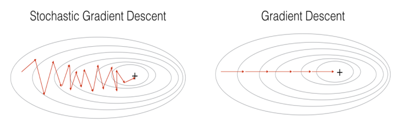

## What is Optimizer

Figure 1: Optimizer Algorithms

### Gradient Descent
- We have the loss function: $L(\theta) $

- $\theta_{t+1} = \theta_{t} - \alpha \times \nabla L(\theta) $
    > - The sign minus "-" indicates that to go **opposite direction of derivative.**
    > - So why is **"opposite direction of derivative"**???
    > - For example: $f(x) = x^2 + 5sin(x)$ with learning rate: 0.10
    

- If we choose different inital x, it will affect the convergence process
- The **learning rate** also has an impact. 
    - If the **learning rate** is too small, the convergence speed is very slow $\to$ affecting the training process
    - If the **learning rate** is too large, it will quickly reach the target. However, the algorithm does not convergent and loops around the destination because the jump is too large

### SGD
> **Stochastic Dradient Descent** is a variantion of **Gradient Descent**. Instead of afger each `epoch` we will update the weight once, in SGD, in each `epoch` with `N` data points we will update the weight `N` times.

### Adam
- Adam = Momentum + RMSProp
- If **Momentum** is like a ball going downhill, then **Adam** is like a heavy ball with friction, so it easily crosses the local minimum to the global minimum and when it reaches the global minimum. It does not take a long time to oscillate back and forth around the target *(dao động qua loại quanh vị trí đích)* because it has friction so it's easier to stop.

- Formula:
    - $m_t \leftarrow \beta_1 m_{t-1} + (1-\beta_1) g_t $
    - $v_t \leftarrow \beta_2 v_{t-1} + (1-\beta_2) g_t^2 $
    - $\hat{m}_t = m_t / (1-\beta_1^t)$
    - $\hat{m}_t = v_t / (1-\beta_2^t)$
    - $\theta_t = \theta_{t-1} - \alpha \times \hat{m_t}/\sqrt{\hat{v_t} + \epsilon} $
    ___
    > - Default hyperparameter:
    >   - $\beta_1=0.9$
    >   - $\beta_2=0.999$
    >   - $\epsilon=10^{-8}$
    > - Initial value:
    >   - $\theta_0=0, m_0=0, v_0 = 0$
    >   - $g_t$ is the gradient descent, equal $\nabla L(\theta)$

- Example we have the loss function: $L(\theta) = \frac{1}{2} (\theta - 3)^2 $ which $\theta$ is the parameter need to be optimized
    > - We can easy know that $\theta = 3$ is the optimal solution. Now we evaluate on Gradient Descent vs Adam
    > - Gradient Descent
    >   - $\theta_{t+1} = \theta{t} - \alpha \nabla L(\theta_{t}) $
    >   - We have: $\nabla L(\theta) = \theta - 3$
    >   - Suppost that we initialize $\theta_0 = 0$ and $\alpha = 0.1$
    >       - $t=0: \theta_0= 0.00 - 0.1 \times (0.00 - 3) = 0.300$
    >       - $t=1: \theta_1= 0.30 - 0.1 \times (0.30 - 3) = 0.570$
    >       - $t=2: \theta_2= 0.57 - 0.1 \times (0.57 - 3) = 0.813$
    >       - $t=3: \theta_3= 0.81 - 0.1 \times (0.81 - 3) = 1.032$
    >       - ...
    >       - $t=57: \theta_57= 2.99 - 0.1 \times (2.99 - 3) = 2.993$
    >       - $t=58: \theta_58= 2.99 - 0.1 \times (2.99 - 3) = 2.994$
    >       - $t=59: \theta_59= 2.99 - 0.1 \times (2.99 - 3) = 2.995$
    >       - $t=60: \theta_60= 2.99 - 0.1 \times (2.99 - 3) = 2.995$
    >       - $t=61: \theta_61= 3.00 - 0.1 \times (3.00 - 3) = 2.996$
    >       - ...
    >       - $t=81: \theta_81= 3.00 - 0.1 \times (3.00 - 3) = 2.999$
    >       - $t=82: \theta_82= 3.00 - 0.1 \times (3.00 - 3) = 3.000$
    >       - ...
    > - Adam (Adaptive Moment Estimation)
    >   - The process like this
    >       - $t=1: m_t=-0.300, v_t=0.009, \hat{m_t}=-3.000, \hat{v_t}=9.000, \theta_{1}=0.100$
    >       - $t=2: m_t=-0.560, v_t=0.017, \hat{m_t}=-2.947, \hat{v_t}=8.705, \theta_{2}=0.200$
    >       - $t=3: m_t=-0.784, v_t=0.025, \hat{m_t}=-2.893, \hat{v_t}=8.416, \theta_{3}=0.300$
    >       - ...
    >       - $t=35: m_t=-0.722, v_t=0.097, \hat{m_t}=-0.741, \hat{v_t}=2.812, \theta_{35}=2.830$
    >       - $t=36: m_t=-0.667, v_t=0.097, \hat{m_t}=-0.682, \hat{v_t}=2.734, \theta_{36}=2.871$
    >       - $t=37: m_t=-0.613, v_t=0.097, \hat{m_t}=-0.626, \hat{v_t}=2.659, \theta_{37}=2.910$
    >       - $t=38: m_t=-0.561, v_t=0.097, \hat{m_t}=-0.571, \hat{m_t}=2.588, \theta_38=2.945$
    >       - $t=39: m_t=-0.510, v_t=0.096, \hat{m_t}=-0.519, \hat{m_t}=2.520, \theta_39=2.978$
    >       - $t=40: m_t=-0.462, v_t=0.096, \hat{m_t}=-0.468, \hat{m_t}=2.456, \theta_40=3.008$
    >       - $t=41: m_t=-0.415, v_t=0.096, \hat{m_t}=-0.420, \hat{m_t}=2.395, \theta_41=3.035$
    >       - ...
    >       - $t=55: m_t=0.020, v_t=0.095, \hat{m_t}=0.020, \hat{v_t}=1.778, \theta_{55}=3.176$
    >       - $t=56: m_t=0.036, v_t=0.095, \hat{m_t}=0.036, \hat{v_t}=1.746, \theta_{56}=3.173$
    >       - $t=57: m_t=0.050, v_t=0.095, \hat{m_t}=0.050, \hat{v_t}=1.715, \theta_{57}=3.169$
    >       - ...
    >       - $t=78: m_t=0.065, v_t=0.093, \hat{m_t}=0.065, \hat{v_t}=1.243, \theta_{78}=3.013$
    >       - $t=79: m_t=0.060, v_t=0.093, \hat{m_t}=0.060, \hat{v_t}=1.227, \theta_{79}=3.008$
    >       - $t=80: m_t=0.055, v_t=0.093, \hat{m_t}=0.055, \hat{v_t}=1.211, \theta_{80}=3.003$
    >       - $t=81: m_t=0.050, v_t=0.093, \hat{m_t}=0.050, \hat{v_t}=1.195, \theta_{81}=2.998$

- The most optimizer used until now is **Adam**. We can see that in the process, the **Adam Optimizer** has good performance, close to global minimum than other method.

### Adadelta

### Adagrad

### RMSProp