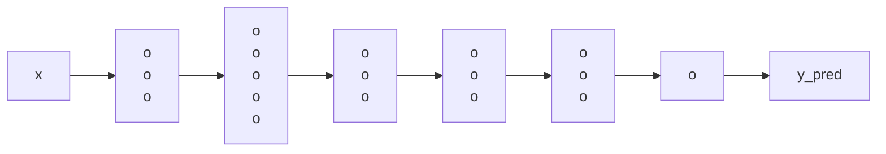
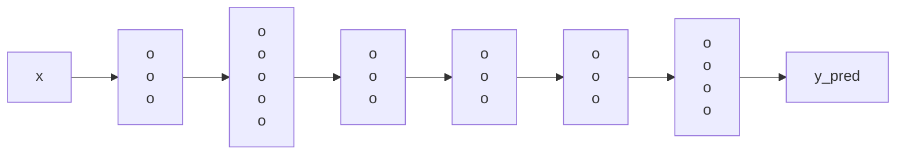

## Transfer Learning

*Model: Image recognition*

## Multi-task Learning

*Model: Simplified autonomous driving*

> [!NOTE]
> Note that 4 neurons in the last hidden layer stand for:
> - pedistrian
> - car
> - stop sign
> - traffic light

> [!NOTE] 
> Nothing

> [!IMPORTANT]
> Nothing

> [!WARNING]
> Nothing
