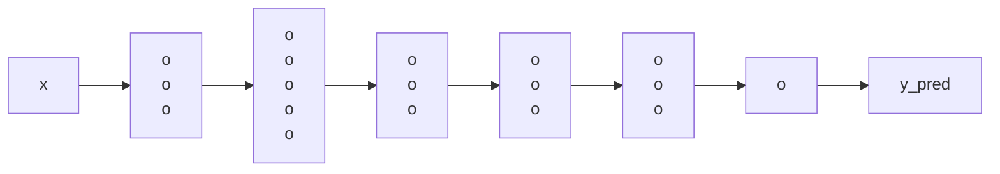
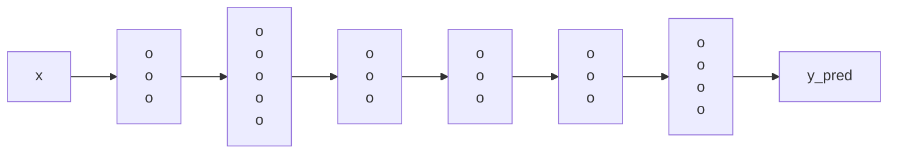

## Transfer Learning

*Model: Image recognition*

## Multi-task Learning

Model: Simplified autonomous driving

> [!NOTE]
> Note that 4 neurons in the last hidden layer stand for:
> - pedistrian
> - car
> - stop sign
> - traffic light

**Loss function:**
$\frac{1}{m} \sum_{i=1}^m \sum_{j=1}^4 L(\hat{y}^{(i)}, y_j^{(i)})$

We want to build the autonomous driving model to identify multiple objects in the same time, include pedestrians, cars, stop signs, traffic lights.

Instead of training 4 seperate model for each task, we use multitask learning to train only 1 model that satisfying 4 tasks above

The main idea of multitask learning is that sharing low-level features of each relevant tasks to improve effeciency. *For example, recognizing pedestrians and cars can be shared the street feature*

The multitask learning model will predict 4 vector values for each input image corresponding 4 classes. Each image may have many objects

The loss function can be optimized by the average of sum of component loss of each object.