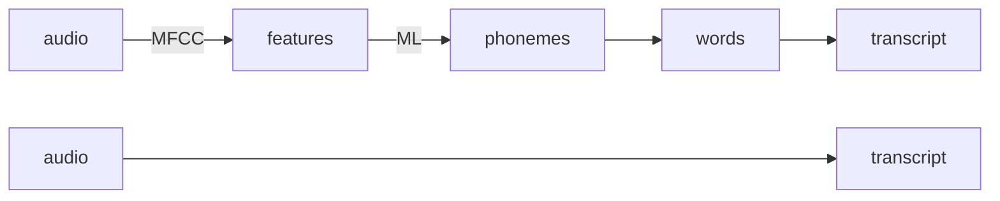

## What is End-to-end Learning?

**Speech recognition example**

> [!IMPORTANT]
> End-to-end learning need to much of data and high quality

## Whether to use End-to-end Deep Learning

**Pros**
- Let the data speak
- Less hand-designing of components needed

**Cons**
- May need large amount of data
- Exclude potentially useful hand-designed components