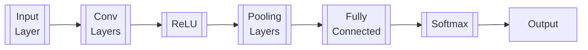
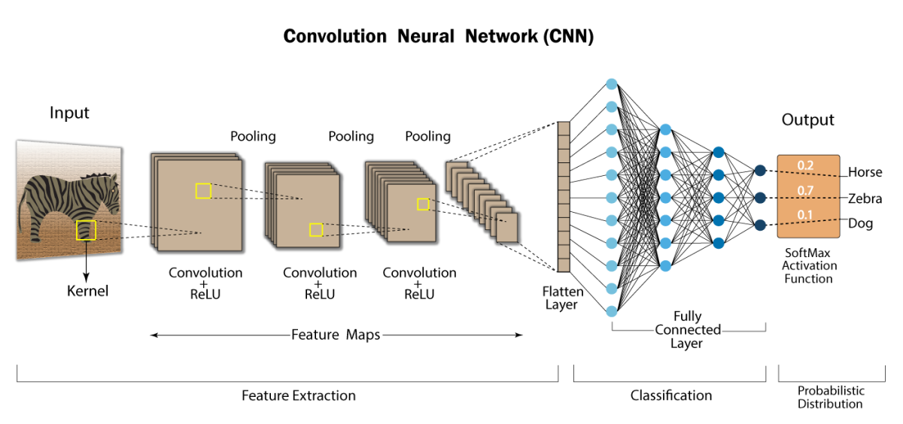

## Convolutional Neural Networks

**Notation**
- $a^{[l]}$ is the $l^{th}$ layer activation
- $W^{[l]}$ and $b^{[l]}$ are the $l^{th}$ layer parameters
- $x^{(i)}$ is the $i^{th}$ training example input

### Model Example





## Zero Padding


The main benefits of padding:
- Prevents output volume from shrinking
- Helps preserve information at the edges of the image


<p style="text-align: center;">Figure 1: Zero-padding</p>


```
def zero_pad(X, pad):
    X_pad = np.pad(X, ((0,0), (pad, pad), (pad, pad), (0,0), 'constant', constant_values=0))
    return X_pad
```

Where:
- **X**: Numpy Array of shape $(m, n_H, n_W, n_C)$
- **pad**: integer, amount of padding around each image on vertical and horizontal dimensions
- **X_pad**: padded image of shape $(m, n_H+2 \times pad, n_W+2 \times pad, n_C)$

## Single Step of Convolution


<p style="text-align: center;">Figure 2: Convolution Operation<br>with a filter of 3x3 and a stride of 1 (stride=amount you move the window each time you slide)</p>

```
def conv_single_step(a_slice_prev, W, b):
    s = np.multiply(a_slice_prev, W)
    Z = np.sum(s)
    Z = np.float64(Z + b)
    return Z
```

Where:
- **a_slice_prev**: slice of input data of shape $(f,f,n_{C}^{<prev>})$
- **W**: Weight parameters - matrix of shape $(f,f,n_{C}^{<prev>})$
- **b**: Bias
- **Z**: A scalar value

## CNN Forward

<video src="img/conv_kiank.mp4" controls title="Title"></video>

$n_H = [\frac{n_{H_{prev}} - f + 2 \times pad}{stride}] + 1 $

$n_W = [\frac{n_{W_{prev}} - f + 2 \times pad}{stride}] + 1 $

$n_C$ = number of filters used in the convolution


<p style="text-align: center;">Figure 3: Definition of a slice using vertical and horizonatal start/end (with a 2x2 filter)</p>