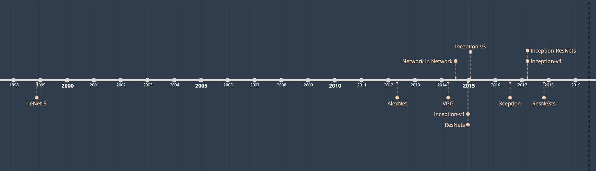
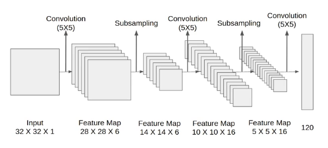
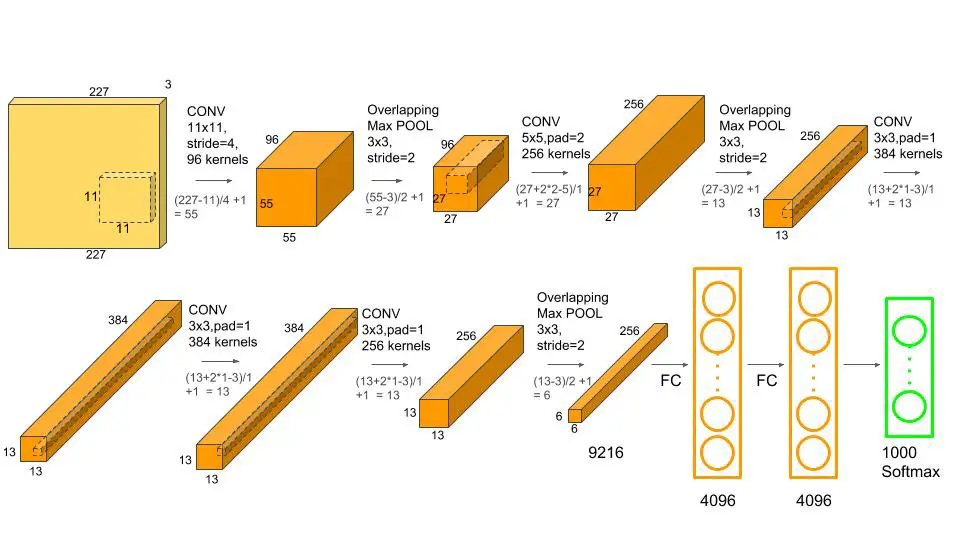
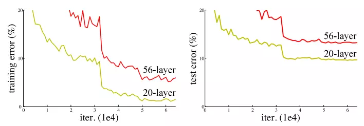
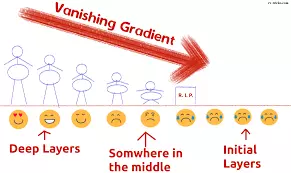
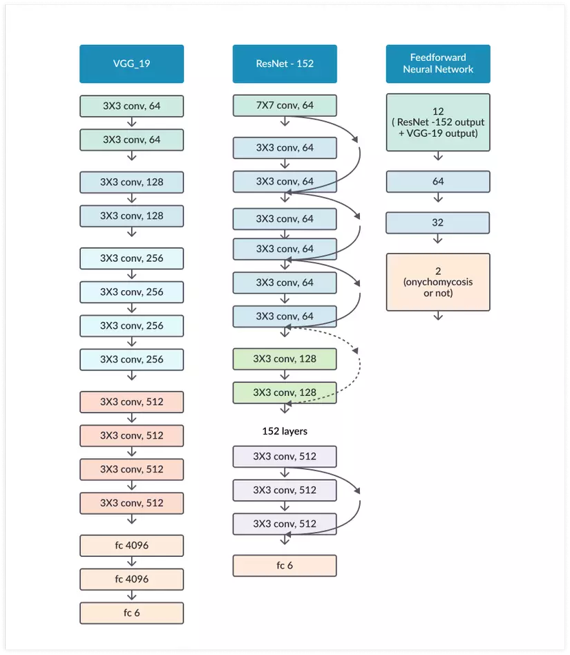
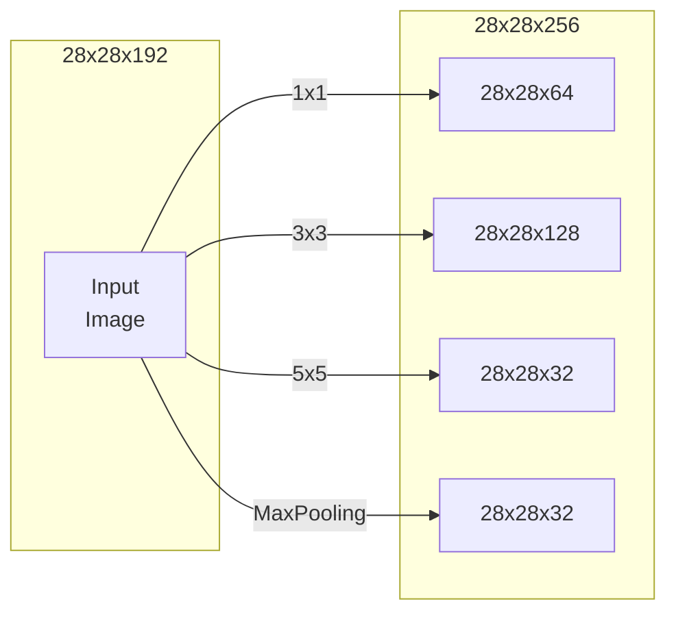
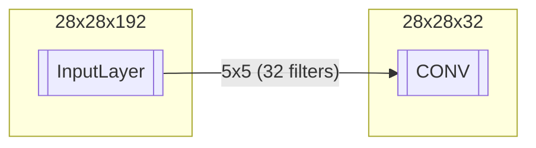
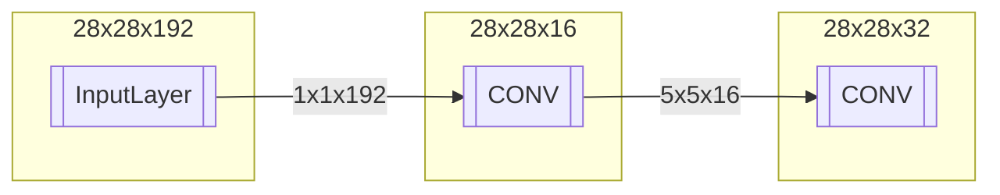
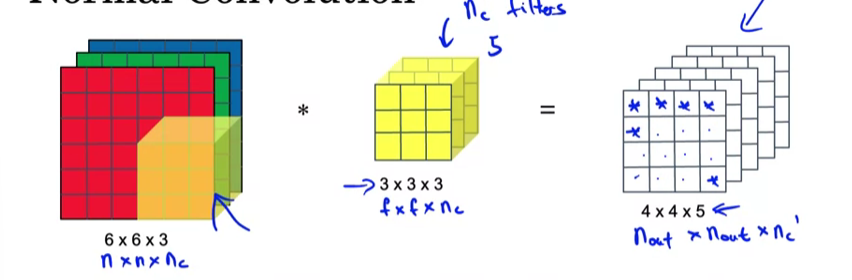

## Classic Networks

### LeNet - 5

### AlexNet

### VGG-16

## Residual Network

### Vanishing Gradient

## ResNet Architecture

Cho nên giải pháp mà ResNet đưa ra là sử dụng kết nối "tắt" đồng nhất để xuyên qua một hay nhiều lớp. Một khối như vậy được gọi là một Residual Block, như trong hình sau :

ResNet gần như tương tự với các mạng gồm có convolution, pooling, activation và fully-connected layer. Ảnh bên trên hiển thị khối dư được sử dụng trong mạng. Xuất hiện một mũi tên cong xuất phát từ đầu và kết thúc tại cuối khối dư. 

Hay nói cách khác là sẽ bổ sung Input X vào đầu ra của layer, hay chính là phép cộng mà ta thấy trong hình minh họa, việc này sẽ chống lại việc đạo hàm bằng 0, do vẫn còn cộng thêm X. Với H(x) là giá trị dự đoán, F(x) là giá trị thật (nhãn), chúng ta muốn H(x) bằng hoặc xấp xỉ F(x). Việc F(x) có được từ x như sau:

$X \to w1 \to ReLU \to w2 $

Giá trị H(x) có được bằng cách:

$F(x) + x \to ReLU $

Như chúng ta đã biết việc tăng số lượng các lớp trong mạng làm giảm độ chính xác, nhưng muốn có một kiến trúc mạng sâu hơn có thể hoạt động tốt.

Hình 1. VGG-19 là một mô hình CNN sử dụng kernel 3x3 trên toàn bộ mạng, VGG-19 cũng đã giành được ILSVRC năm 2014.

Hình 2. ResNet sử dụng các kết nối tắt (kết nối trực tiếp đầu vào của lớp (n) với (n+x) được hiển thị dạng mũi tên cong).

Hình 3. Tổng cộng có 12 đầu ra từ ResNet-152 và VGG-19 đã được sử dụng làm đầu vào cho mạng có 2 lớp hidden. Đầu ra cuối cùng được tính toán thông qua hai lớp ẩn ( hidden). Việc xếp chồng các lớp sẽ không làm giảm hiệu suất mạng.

### Build ResNet-50

## Inception Network

**The problem of computational cost**

$\to$ 32 filters

28x28x32x5x5x192 $\to$ 120M

**Using 1x1 Convolution**

$\to$ 28x28x16x192 = 2.4M

$\to$ 28x28x32x5x5x16 = 10M

$\to$ 12.4M << 120M (above)

## MobileNets

**Normal Convolution**

$ComputationalCost = FilterParams \times FilterPositions \times NumberOfFilters$

$\to (3\times3\times3) \times (4\times4) \times 5 =2160$

**Depthwise Separable Convolution**

