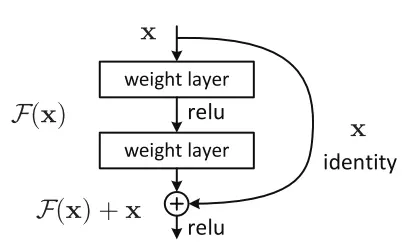
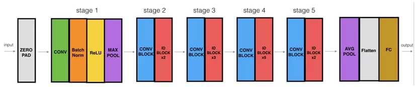

## Classic Networks

### LeNet - 5

### AlexNet

### VGG-16

## Residual Network

### Tại sao lại xuất hiện mạng ResNet
Mạng ResNet (R) là một mạng CNN được thiết kế để làm việc với hàng trăm lớp. Một vấn đề xảy ra khi xây dựng mạng CNN với nhiều lớp chập sẽ xảy ra hiện tượng Vanishing Gradient dẫn tới quá trình học tập không tốt.

### Vanishing Gradient
Trước hết thì Backpropagation Algorithm là một kỹ thuật thường được sử dụng trong quá trình tranining. Ý tưởng chung của thuật toán lá sẽ đi từ output layer đến input layer và tính toán gradient của cost function tương ứng cho từng parameter (weight) của mạng. Gradient Descent sau đó được sử dụng để cập nhật các parameter đó.

Toàn bộ quá trình trên sẽ được lặp đi lặp lại cho tới khi mà các parameter của network được hội tụ. Thông thường chúng ta sẽ có một hyperparametr (số Epoch - số lần mà traninig set được duyệt qua một lần và weights được cập nhật) định nghĩa cho số lượng vòng lặp để thực hiện quá trình này. Nếu số lượng vòng lặp quá nhỏ thì ta gặp phải trường hợp mạng có thể sẽ không cho ra kết quả tốt và ngược lại thời gian tranining sẽ lâu nếu số lượng vòng lặp quá lớn.

Tuy nhiên, trong thực tế Gradients thường sẽ có giá trị nhỏ dần khi đi xuống các layer thấp hơn. Dẫn đến kết quả là các cập nhật thực hiện bởi Gradients Descent không làm thay đổi nhiều weights của các layer đó và làm chúng không thể hội tụ và mạng sẽ không thu được kết quả tốt. Hiện tượng như vậy gọi là Vanishing Gradients.

## ResNet Architecture

Cho nên giải pháp mà ResNet đưa ra là sử dụng kết nối "tắt" đồng nhất để xuyên qua một hay nhiều lớp. Một khối như vậy được gọi là một Residual Block, như trong hình sau :

ResNet gần như tương tự với các mạng gồm có convolution, pooling, activation và fully-connected layer. Ảnh bên trên hiển thị khối dư được sử dụng trong mạng. Xuất hiện một mũi tên cong xuất phát từ đầu và kết thúc tại cuối khối dư. Hay nói cách khác là sẽ bổ sung Input X vào đầu ra của layer, hay chính là phép cộng mà ta thấy trong hình minh họa, việc này sẽ chống lại việc đạo hàm bằng 0, do vẫn còn cộng thêm X. Với H(x) là giá trị dự đoán, F(x) là giá trị thật (nhãn), chúng ta muốn H(x) bằng hoặc xấp xỉ F(x). Việc F(x) có được từ x như sau:

$X \to w1 \to ReLU \to w2 $

Giá trị H(x) có được bằng cách:

$F(x) + x \to ReLU $

Như chúng ta đã biết việc tăng số lượng các lớp trong mạng làm giảm độ chính xác, nhưng muốn có một kiến trúc mạng sâu hơn có thể hoạt động tốt.

Hình 1. VGG-19 là một mô hình CNN sử dụng kernel 3x3 trên toàn bộ mạng, VGG-19 cũng đã giành được ILSVRC năm 2014.

Hình 2. ResNet sử dụng các kết nối tắt (kết nối trực tiếp đầu vào của lớp (n) với (n+x) được hiển thị dạng mũi tên cong). Qua mô hình nó chứng minh được có thể cải thiện hiệu suất trong quá trình training model khi mô hình có hơn 20 lớp.

Hình 3. Tổng cộng có 12 đầu ra từ ResNet-152 và VGG-19 đã được sử dụng làm đầu vào cho mạng có 2 lớp hidden. Đầu ra cuối cùng được tính toán thông qua hai lớp ẩn ( hidden). Việc xếp chồng các lớp sẽ không làm giảm hiệu suất mạng.Với kiến trúc này các lớp phía trên có được thông tin trực tiếp hơn từ các lớp dưới nên sẽ điều chỉnh trọng số hiệu quả hơn.

### Build ResNet-50

"ID BLOCK" trong hình trên là viết tắt của từ Identity block và ID BLOCK x3 nghĩa là có 3 khối Identity block chồng lên nhau. Nội dung hình trên như sau :

- Zero-padding : Input với (3,3)
- Stage 1 : Tích chập (Conv1) với 64 filters với shape(7,7), sử dụng stride (2,2). BatchNorm, MaxPooling (3,3)
- Stage 2 : Convolutiontal block sử dụng 3 filter với size 64x64x256, f=3, s=1. Có 2 Identity blocks với filter size 64x64x256, f=3
- Stage 3 : Convolutional sử dụng 3 filter size 128x128x512, f=3,s=2. Có 3 Identity blocks với filter size 128x128x512, f=3
- Stage 4 : Convolutional sử dụng 3 filter size 256x256x1024, f=3,s=2. Có 5 Identity blocks với filter size 256x256x1024, f=3
- Stage 5 :Convolutional sử dụng 3 filter size 512x512x2048, f=3,s=2. Có 2 Identity blocks với filter size 512x512x2048, f=3.
The 2D Average Pooling : sử dụng với kích thước (2,2)
- The Flatten
- Fully Connected (Dense) : sử dụng softmax activation

## Motivation for Inception Network

**The problem of computational cost**

$\to$ 32 filters

28x28x32x5x5x192 $\to$ 120M

**Using 1x1 Convolution**

$\to$ 28x28x16x192 = 2.4M

$\to$ 28x28x32x5x5x16 = 10M

$\to$ 12.4M << 120M (above)