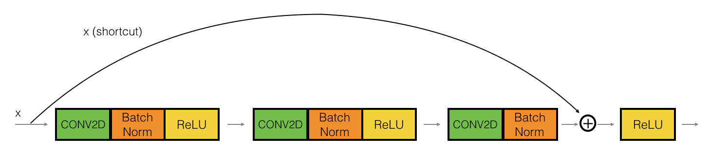

## The Problem of Very Deep Neural Networks

Figure 1: Vanish Gradient The speed of learning decrease very rapidly for the shallower layers as the network trains

## Building a Residual Network

Figure 2: A ResNet block showing a Skip-Connection

### The Identity Block

Figure 3: Identity block. Skip connection "skips over" 2 layers

Figure 4: Identity block. Skip connection "skips over" 3 layers

### The Convolutional Block

## Building ResNet Model (50 layers)

Figure 5: ResNet-50 model

