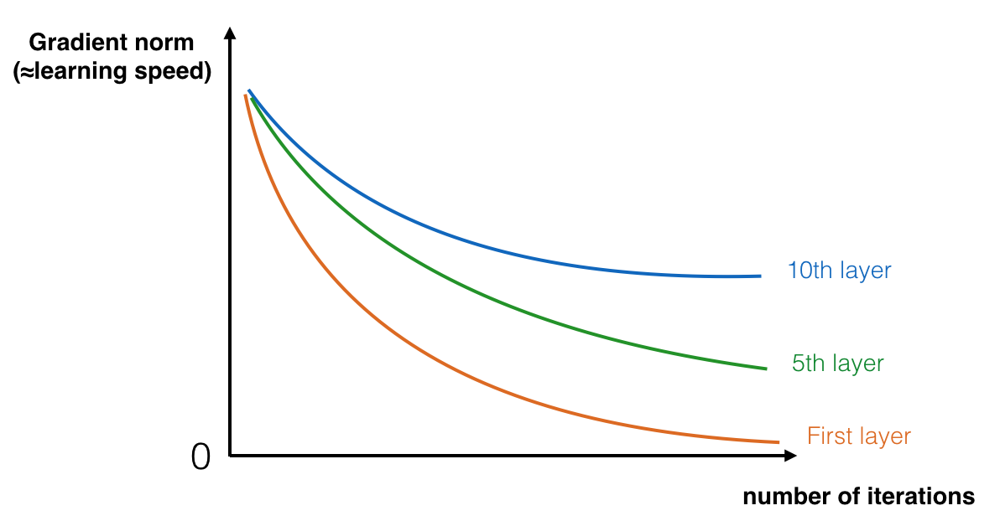

## The Problem of Very Deep Neural Networks
> - Very, very deep Neural Networks are difficult to train beause of vanishing and exploding gradients problems
> - In this section we will learn about skip connection which makes you take the activatin from 1 layer and suddenly feed it to another layer even much deeper in NNs which allows you to train large NNs even with layers greater than 100



<p style="text-align: center">Figure 1: Vanish Gradient</br>The speed of learning decrease very rapidly for the shallower layers as the network trains</p>

## Why ResNets work
- Let's see some example that illustrates why ResNets work
    - We have a big NNs as the following:
    ```mermaid
    flowchart LR;
        X --> A[[Big\nNeural\nNetworks]] --> B["a[l]"]
    ```
    - Let's add 2 layers to this network as a residual block:
    ```mermaid
    flowchart LR;
        X --> A[[Big\nNeural\nNetworks]] --> Layer1 --> Layer2 --> B["a[l+2]"]
    ```
    - Suppose we are using ReLU activations
    - Then: $a^{[l+2]} = g(z^{[l+2]} + a^{[l]}) = g(W^{[l+2]} \times a^{[l+1]} + b^{[l+2]} + a^{[l]}) $
    > - Then if we are using L2 regularization for example, $W^{[l+2]}$ will be `0`. Let's say that $b^{[l+2]}$ will be `0` too.
    > - Then $a^{[l+2]} = g(a^{[l]}) = a^{[l]} $ with no negative values
    > - This show that identity function is easy for a residual block to learn. And that why it can train deeper NNs

- Let's take a look at ResNet on images:
    - Here are the architecture of ResNet-34
    
    > - All the 3x3 Conv are same Convs
    > - Keep it simple in design of the network
    > - No FC layers, No dropout is use
    > 2 maintypes of blocks are used in a ResNet, depending mainly on whether the input/output dimension are same or different. You are going to implement both of them.

## Building a Residual Network


<p style="text-align: center">Figure 2: A ResNet block showing a Skip-Connection</p>

> The lecture mentioned that having ResNet blocks with the shortcut also makes it very easy for one of the blocks to learn an identity function. This means that you can stack on additional ResNet blocks with little risk of harming training set performance.

### The Identity Block


<p style="text-align: center">Figure 3: Identity block. Skip connection "skips over" 2 layers</p>

> - Hint the Conv is followed by a **Batch Norm** before **ReLU**. Dimensions here are same
> - This skip over 2 layers. The skip connection can jump `n` connnections where `n>2`


<p style="text-align: center">Figure 4: Identity block. Skip connection "skips over" 3 layers</p>

[!IMPORTANT]
> The Conv can be bottleneck 1x1 Conv

### The Convolutional Block


<p style="text-align: center">Figure 4: Convolutional block</p>

> The Conv2D layer in the shortcut path is used to resize the input x to a different dimension, so that the dimensions match up in the final addition needed to add the shortcut value back to the main path.

## Building ResNet Model (50 layers)


<p style="text-align: center">Figure 5: ResNet-50 model</p>
