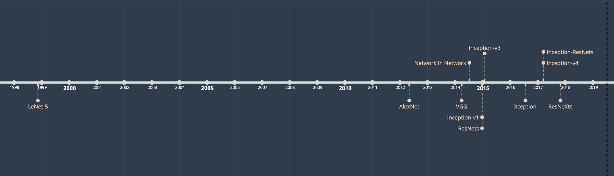
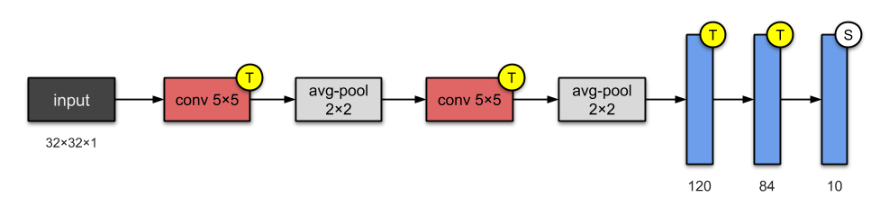

## Convolutional Neural Networks Architecture

### 1. LeNet-5 (1998)

LeNet Architecture

### 2. AlexNet (2012)

AlexNet Architecture

### 3. VGG-16 (2014)

VGG-16 Architecture

### 4. GoogleNet / Inception-v1 (2014)

Inception-v1 Architecture

### 5. GoogleNet / Inception-v3 (2015)

Inception-v3 Architecture

### 6. ResNet-50 (2015)

ResNet Architecture include 2 feature blocks: Conv Block and Identity Block

Summary of ResNet-50 Architecture

## 7. DenseNet (2016)

DenseNet Architecture

Layers Detail in DenseNet
