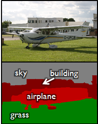
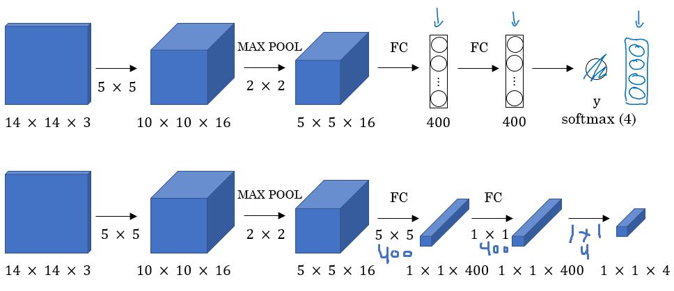

## Object Detection
> Learn how to apply your knowledge of CNNs to one of the toughest but hottest field of Computer Vision: **Object Detection**

### Object Localization
- Object detection is one of the areas in which Deep Learning is going great in the pass 2 years
- What are localization and detection?
    - Image classification
        > Classify an image to a specific class. The whole image represents 1 class. We don't want to know exactly where are the object. Usually only 1 object is presented.
        

    - Classification with localization:
        > Given an image we want to learn the class of the image and where are the class location in the image. We need to detect a class and a rectangle of where that object is. Usually only 1 object is presented
        

    - Object Detection
        > Given an image we want to detect all the objects in the image that belong to a specific classes and give their location. An image can contain more than 1 object with different classes
        

    - Segmantic Segmentation
        > - We want to label each pixel in the image with a category label. Segmantic Segmentation don't differentiate instances, only care about pixels. It detects no objects just pixels.
        > - If there are 2 objects of the same class is intersected, we won't be able to separate them.
        

    - Instance Segmentation
        > This is like the full problem. Rather than we want to predict the bounding box, we want to know which pixel lable but alse distinguish them.
        

- To make image classification we use a Convolutional Networks with a Softmax attached to the end of it

- To make classification with localization, we use a Convolutional Networks with a softmax attached to the end of it and 4 numbers: `bx`, `by`, `bh`, `bw` to tell you the location of the class in the image. The dataset should contain this 4 numbers with the class too.

- Example:

- Loss function:

### Landmark Detection
- In some CV problems, you need to output some points. That is call **landmark detection**

    > *Example:* Face recognition:
    > - Corners of eyes
    > - Corners of mouth
    > - Corners of nose ...

### Object Detection
- Sliding windows detection algorithm
- Example: **Car Object Detection**
    > - First, we train Convolutional Networks on **cropped car images** and **non-car image**
    > - Then use it with the **sliding windows technique**
    

- Sliding windows detection algorithm (SWDA):
    - Decide a rectangle size
    - Split input image into rectangles (picked above), can use some **stride S**
    - For each rectangle feed the image into the Conv Net and decide if its a car or not
    - Pick larger/smaller rectangles, repeat from 2-3
    - Store the rectangle that contains the cars
    - If 2 rectangle intersects, choose the rectangle with the best accuracy. *(Of course)*

### Convolutional Implement of Sliding Windows

- Turn **FC Layer** into **Conv Layers** (predict image class from 4 class)

- Convolution Implementation of Sliding windows
    - Conv Net
    
    - 16x16x3 image that need to apply Sliding Windows Algorithm
        > The normal implementation: run this Conv Net 4 times each rectangle size will be 16x16

    - The Convolution Implementation will be as follow:
    

- **Weakness**: Position of rectangle won't be accurate.

    
    > In red, the rectangle we want and in blue is the required car rectangle

### Bounding Box Predictions
- YOLO (You Only Look Once)

### Intersection Over Union

### Non-max Suppression

### Anchor Boxes

### YOLO Algorithm