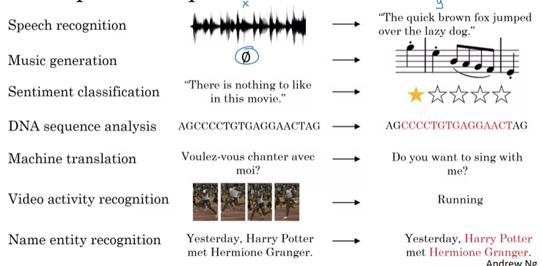
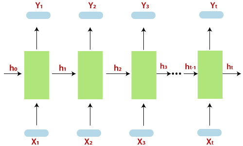
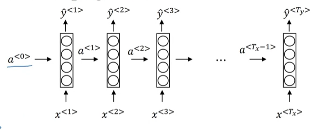

## Example of Sequence data

**Notation**

X: Harry Potter and Hermione Granger invented a new spell

y: 1 1 0 1 1 0 0 0 0

|Words|Value|
|:-:|:-:|
|Harry|1|
|Potter|1|
|and|0|
|Hermione|1|
|Granger|1|
|invented|0|
|a|0|
|new|0|
|spell|0

We denote that:

|..|..|
|:-:|:-:|
|$X^{(i)<t>}$|Training set|
|$T_X^{(i)}$|Length of $X^{(i)}$|
|$y^{(i)<t>}$|Output sequence|
|$T_y^{(i)}$|Length of $y^{(i)}$|

**Representing words**

Gated Recurrent Unit (GRU)

$c^{<t>} = \Gamma_u \times \tilde{c}^{<t>} + (1-\Gamma_u) \times c^{t-1}$

## Recurrent Neural Network Model
### Why not a standard network?

```mermaid
flowchart LR;
    X1 ---> A[O\nO\n.\n.\n.\n.\n.\nO]
    X2 ---> A
    ... ---> A
    X_Tx ---> A
    A --> B[o\no\n.\n.\n.\no]
    B --> y1
    B --> y2
    B --> ..
    B --> y_Ty
```
_

**Problem**
- Inputs, Outputs can be different lengths in different examples
- Do not share features learned across different positions of next

### Recurrent Neural Networks

$\to T_x = T_y$

Sometimes we can denote the model like this:

```mermaid
flowchart TD;
    y_t
    A[o\no\n...\no]
    X_t
    A --> A
    y_t --- A
    A --- X_t
```

## Forward Propagation

[!NOTE]
> - $\vec{a} = \vec{0}$
> - $a \to W_{ax} \times X^{<i>} $

- $a^{<i>} = g_1(W_{aa}\times a + W_{ax} \times X + b_a) \to tanh/ ReLU$

- $\hat{y}^{<i>} = g_2(W_{ya} \times a^{<i>} + b_y) \to sigmoid$

- $a^{<t>} = g(W_{aa} \times a^{<t-1>} + W_{ax} \times X^{<t>} + b_a) $

- $\hat{y}^{<t>} = g(W_{ya} \times a^{<t>} + b_y) $

## Back Propagation

**Loss function**

$L^{<t>}(\hat{y}^{<t>}, y^{<t>}) = -y^{<t>} \times log \hat{y}^{<t>} - (1-y^{<t>}) \times log(1-\hat{y}^{<t>})$

$\to L^{<t>}(\hat{y}, y) = \sum_{t=1}^{T_y} L^{<t>}(\hat{y}^{<t>}, y^{<t>}) $

**Backpropagation through time**

$\frac{\partial{L^{(T)}}}{\partial{W}} = \sum_{t=1}^T \frac{\partial{L^{(T)}}}{\partial{W}} $

**Commonly used activation functions**

|Activation|Formula|
|:-:|:-:|
|Sigmoid|$\frac{1}{1+e^{-z}}$|
|Tanh|$\frac{e^z-e^{-z}}{e^z+e^{-z}} $|
|RELU|$max(0,z)$|