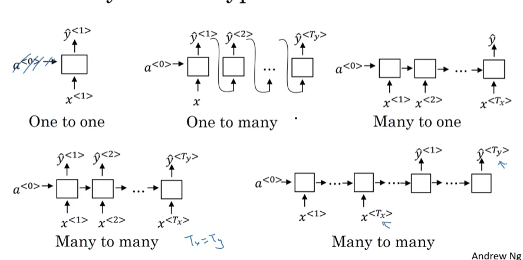
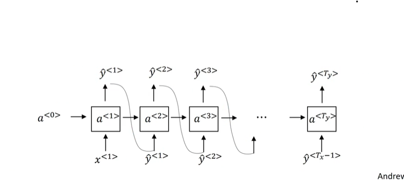

## Different types of RNNs

There are 4 types:
- One - One
- One - Many
- Many - One
- Many - Many

## Language Model & Sequence Generation

### What is language modeling?
**Speech Recognition**
- The apple and pair salad
- The apple and pear salad

P(The apple and pair salad) = $3.2 \times 10^{-13}$

P(The apple and pear salad) = $5.7 \times 10^{-10}$

### Language modeling with and RNN
Training set: large corpus of english text (**tokens**)

### RNN Model

$L(\hat{y}^{<t>}, y^{<t>}) = -\sum_{i} y_i^{<t>} log \hat{y}^{<t>}$

$L = \sum_i L^{<t>}(\hat{y}^{<t>}, y^{<t>}) $

## Sampling Novel Sequences

Sampling a sequence from a trained RNN

Vocabulary = [a, aaron, ... , zulu, \<UNK>]

## Vanish Gradients with RNNs
The vanishing and exploding gradient phenomena are often encountered in the context of RNNs. The reason why they happen is that it is difficult to capture long term dependencies because of multiplicative gradient that can be exponentially decreasing/increasing with respect to the number of layers.