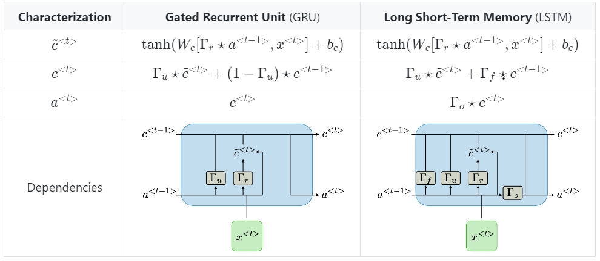

## RNN Unit

$a^{<t>} = g(W_a[a^{<t-1>}, x^{<t>}] + b_a) $

**Types of gates**

$\Gamma = \sigma(W_X^<t> + U_a^{<t-1>} + b) $

|Type of gate|Role|Used in|
|:-:|:-:|:-:|
|Update gate $\Gamma_u$|How much past should matter now|GRU, LSTM|
|Relevance gate $\Gamma_u$|Drop previous information?|GRU,LSTM|
|Forget gate $\Gamma_f$|Erase a cell or not?|LSTM|
|Output gate $\Gamma_o$|How much to reveal of a cell|LSTM|

**Full GRU**

$\tilde{c}^{<t>} = tanh(W_c[\Gamma_r \times c^{<t-1>}, x^{<t>}] + b_c) $

$\Gamma_u = \sigma(W_u[c^{<t-1>}, x^{<t>}] + b_u) $

$\Gamma_r = \sigma(W_r[c^{<t-1>}, x^{<t>}] + b_r) $

$c^{<t>} = \Gamma_u \times \tilde{c}^{<t>} + (1-\Gamma_u) \times c^{<t-1>} $

