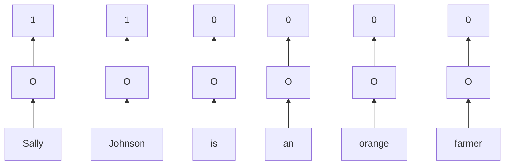

## Word Representation
**One-hot Encoding**

|Man|Woman|King|Queen|Apple|Orange|
|:-:|:-:|:-:|:-:|:-:|:-:|
|5391|9853|4914|7157|456|6257|
|$\begin{bmatrix} 0\\0\\0\\0\\...\\1\\...\\0\\0 \end{bmatrix}$|$\begin{bmatrix} 0\\0\\0\\0\\0\\...\\1\\...\\0 \end{bmatrix}$|$\begin{bmatrix} 0\\0\\0\\...\\1\\...\\0\\0\\0 \end{bmatrix}$|$\begin{bmatrix} 0\\0\\0\\0\\0\\...\\1\\...\\0 \end{bmatrix}$|$\begin{bmatrix} 0\\...\\1\\...\\0\\0\\0\\0\\0 \end{bmatrix} $|$\begin{bmatrix} 0\\0\\0\\0\\0\\...\\1\\...\\0 \end{bmatrix} $|

e.g. I want a glass of orange _______.

e.g. I want a glass of apple _______.

$\to$ **juice**

**Feturized Representation: Word Embedding**

||Man|Woman|King|Queen|Apple|Orange|
|-|:-:|:-:|:-:|:-:|:-:|:-:|
|Gender|-1|1|-0.95|0.97|0.00|0.01|
|Royal|0.01|0.02|0.93|0.95|-0.01|0.00|
|Age|0.03|0.02|0.7|0.69|0.03|-0.02|
|Food|0.04|0.01|0.02|0.01|0.95|0.97|
|Size|
|Cost|
|...|

$\to$ About 300 diffent features

## Using Word Embeddings

**Name Entity Recognition Example**

**Transfer Learning & Word Embeddings**
1. Learn word embeddings from large text corpus (1-100B words) *(Or download pre-trained embedding online)*
2. Transfer embedding to new task with smaller training set (say, 100K words)
3. Optional: Continue to finetune the word embeddings with new data

## Properties of Word Embeddings

$sim(A,B) = cos{\theta} = \frac{A.B}{||A||||B||} $

## Embedding Matrix

## Some way to represent words
1. Represent by number

2. Using **One-hot vector**: This vector has only 1 value of "1", the others are "0". Example: [1 0 0 0 ...0]. But the dimension is very very large, this will effect on the computation, storage and training.

3. Random Vector: For example, if we have 1,000,000 words, we can represent they in 3D, each word is a point in 3D Space.

3. Using Word Embedding: There are somme method to create **Word Embedding**:
- Continuous Bag of Word (CBOW)
- Skip Gram
