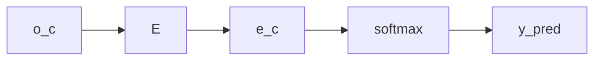
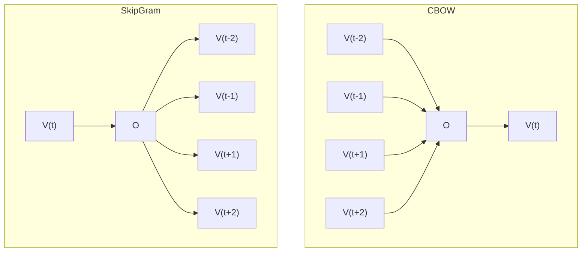
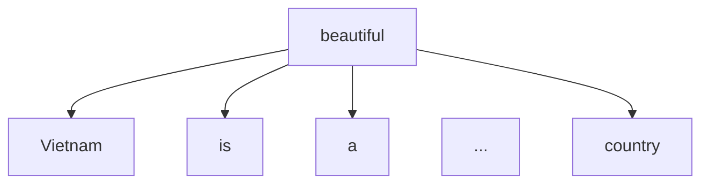

## Learning Word Embeddings

**Neural Language Model**

|I|want|a|glass|of|orange|_____|
|:-:|:-:|:-:|:-:|:-:|:-:|:-:|
|4343|9665|1|3852|6163|6257|...

|word|...|
|-|-|
|I| $o_{4343} \to E \to e_{4343}$|
|want| $o_{9665}\to E \to e_{9665}$|
|a| $o_{1}\to E \to e_1$|
|glass| $o_{3852}\to E \to e_{3852}$|
|of| $o_{6163}\to E \to e_{6163}$|
|orange| $o_{6257}\to E \to e_{6257}$|

$\to$ **juice**

**Other contex/target pairs**

## Word2Vec

### Skip-grams
Model

Vocab size = 10,000

Problem with softmax classification

$p(t|c) = \frac{e^{\theta_j^T e_c}}{\sum_{j=1}^{10,000} e^{\theta_j^T e_c}} $

Where $\theta_t$ = parameter associated with output t

How to sample the context **$e_c$**

- the, of, a, and, to,...
- orange, apple, ...

### Skip Gram and CBOW

Example for Skip Gram

### One hot Vector
- One-hot Vector: One element of vector is 1, remaining elements are 0
- Leng of One-hot Vector equals the number of words in corpus

## Negative Sampling

$p(y=1 |c,t) = \sigma(\theta_t^T e_c) $

## GloVe Word Vectors

$X_{ij} \to$ times i appears in context of j

**Model**

Minimize $\sum_{i=1}^{10,000} \sum_{j=1}{10,000} f(X_{ij})(\theta_i^T e_j - logX_{ij})^2 $

$f(X_{ij}): weighting-term$

$f(X_{ij}) = 0$ at $X_{ij}=0$

$\to$ this, is, at, a,...